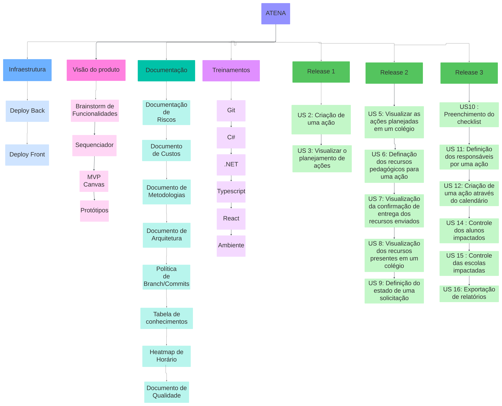

# Estrutura Analítica do Projeto

## 1. Introdução

A Estrutura Analítica de Projeto (EAP) é uma ferramenta de gerenciamento de projetos que divide um projeto complexo em partes menores e mais gerenciáveis, em uma representação hierárquica de todas as tarefas, entregas e atividades necessárias para completar um projeto com sucesso. A EAP ajuda a garantir que todos os aspectos do projeto sejam cobertos e facilita o planejamento, o controle e o monitoramento do projeto.

## 2. Diagrama

## Versionamento

| **Data**   | **Descrição**        | **Autor(es)**           |
| ---------- | -------------------- | ----------------------- |
| 15/07/2024 | Criação do diagrama  | Matheus, Murilo, Wesley |
| 28/07/2024 | Criação do documento | Matheus Clemente        |
