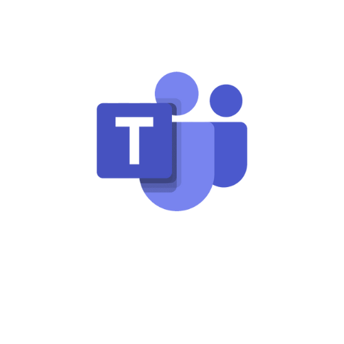

# Planejamento da comunicação externa e interna

## 1. Introdução

&emsp;&emsp;Este documento visa detalhar a estrutura organizada para gerenciar os aspectos da comunicação interna e externa da equipe.

## 2. Ferramentas utilizadas

&emsp;&emsp;Serão utilizadas as seguintes ferrramentas ao longo do projeto:

| **Logo**                                                                           | **Nome**        | **Finalidade**                                                                                           |
| ---------------------------------------------------------------------------------- | --------------- | -------------------------------------------------------------------------------------------------------- |
|   | Discord         | Comunicação assincrona entre a equipe, donos do produto e professor, além de reuniões internas da equipe |
|    | Github          | Repositório com os documentos, códigos e demais recursos referentes ao projeto                           |
|     | Google Drive    | Gerenciamento de arquivos, como planilhas e documentos de texto                                          |
|     | Microsoft Teams | Reuniões com os clientes e demais reuniões que necessitem de gravação                                    |
|  | Whatsapp        | Comunicação rápida entre os integrantes da equipe                                                        |
|    | ZenHub          | Acompanhamento e gerenciamento do projeto                                                                |

## 3. Reuniões

&emsp;&emsp;Com _sprints_ de 1 semana, teremos as seguintes reuniões semanais.

|                               **Objetivo**                                | **Envolvidos**                | **Dia e Horário**            | **Ferramenta** |
| :-----------------------------------------------------------------------: | ----------------------------- | ---------------------------- | -------------- |
|                  _Review_, _Retrospective_ e _planning_                   | EPS e MDS                     | Segunda-feira, 19:00 - 20:00 | Teams/Discord  |
| Reunião de revisão e acompanhamento com os donos do produto e o professor | EPS, MDS, DNIT e Prof. Hilmer | Segunda-feira, 18:00 - 19:00 | Teams          |

## Referências

> EQUIPE DNIT 2023-2. Plano de Comunicação. Disponível em: <https://fga-eps-mds.github.io/2023.2-Dnit-DOC/plano-monitoramento/plano-comunicacao/>

## Histórico de versão

| **Data**   | **Descrição**        | **Autor(es)**    |
| ---------- | -------------------- | ---------------- |
| 28/07/2024 | Criação do documento | Matheus Clemente |
