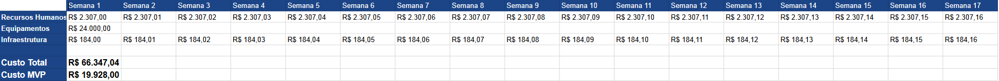

# Plano de custos

## 1. Introdução

&emsp;&emsp;Este documento fornece uma estimativa de custos semanais para o semestre, com o objetivo de iniciar e fundamentar a elaboração de estimativas futuras mais precisas e dinâmicas.

## 2. Estimativa de custos

&emsp;&emsp;Para a estimativa desse projeto, foi realizado o cálculo considerando recursos humanos, equipamentos e infraestrutura.

### 2.1. Recursos humanos

&emsp;&emsp;Segundo o [Jornal da UNESP](https://jornal.unesp.br/2022/06/08/cobranca-de-mensalidade-nao-e-a-solucao-para-o-financiamento-da-universidade-publica/), o custo médio anual por aluno de instituto federal no ano de 2015 foi de aproximadamente R$40.900. Corrigido pela inflação para o mês de abril de 2024, o valor passa para R$ 58.828,62 por ano.

&emsp;&emsp;Ao considerarmos o curso de Engenharia de Software, com duração de 5 anos e carga horária total de 3600 horas, temos:

- **Custo médio por hora**: custo médio anual por integrante x quantidade padrão de anos de curso ÷ quantidade de horas totais para formação no curso **`58.828,62 x 5 ÷ 3600 = R$ 81,70`**

- **Custo médio por integrante na disciplina de EPS/MDS**: custo médio por hora x quantidade de horas da disciplina e extraclasse **`81,70 x 60 = R$ 4.902,38`**

Considerando também as 17 semanas de projeto e os 8 integrantes da equipe, temos os seguintes cálculos:

- **Custo TOTAL da equipe**: custo médio por integrante na disciplina de EPS/MDS x quantidade de integrantes da equipe **`4.902,38 x 8 = R$ 39.219,04`**

- **Custo médio semanal da equipe**: custo TOTAL da equipe ÷ quantidade de semanas do projeto **`39.219,04 ÷ 17 = R$ 2.307,00`**

### 2.2. Equipamentos

&emsp;&emsp;Para a estimativa de custos com equipamento, que não se trata de um custo recorrente, foi considerado o preço de um notebook Intel Core I5 com 8gb de memória RAM, em torno de R$ 3.000,00 segundo [Amazon](https://www.amazon.com.br/). Considerando os 8 integrantes da equipe:

- **Custo TOTAL dos equipamentos**: custo médio do notebook x quantidade de integrantes da equipe **`3.000 x 8 = R$ 24.000,00`**

### 2.3. Infraestrutura

&emsp;&emsp;A estimativa de custos de infraestrutura levou em consideração o uso de energia elétrica e internet.

#### 2.3.1. Internet

&emsp;&emsp;Para cálculo do custo de internet utilizaremos o preço médio de planos de 250 MB por mês que, é cerca de R$ 90,00.

- **Custo semanal de internet por integrante**: custo mensal da internet ÷ quantidade de semanas no mês **`90 ÷ 4 = R$ 22,50`**

- **Custo semanal de internet por equipe**: custo semanal da internet por integrante x quantidade de integrantes **`22,50 x 8 = R$180,00`**

#### 2.3.2. Energia

&emsp;&emsp;Segundo os dados da [tabela de tarifas da Neoenergia Brasília](https://www.neoenergia.com/documents/d/brasilia/02_neoenergia-brasilia_tarifas-de-energia-eletrica-grupo-b_outubro_2023_reh_n-3-276-pdf?download=true) , vigente de outubro de 2023 à outubro de 2024, o custo do KW/h residencial, consumo ativo, de Brasília é cerca de R$ 0,7662. Segundo dados de 2021 da [cultura UOL](https://cultura.uol.com.br/noticias/26097_6-maneiras-de-economizar-na-conta-de-luz-do-home-office.html), um notebook consome em média cerca de 65W/h, conectado ao carregador. Consideramos que cada integrante da equipe trabalhará 10 horas por semana em sua residência, ao longo de 17 semanas. Utilizando esses dados para cálculo, temos:

- **Consumo do notebook em KW/h**: consumo x horas ÷ 1000
  **`65 x 1 ÷ 1000 = 0,065 KW/h`**

- **Custo semanal de energia por integrante**: horas de trabalho x consumo do notebook x tarifa
  **`10 x 0,065 x 0,7662 = R$ 0,50`**

- **Custo semanal de energia por equipe**: custo semanal por integrante x quantidade de integrantes da equipe **`0,50 x 8 = R$ 4,00`**

#### 2.3.3. Custo TOTAL em infraestrutura

&emsp;&emsp;Somando as estimativas de custo semanal de internet (R$ 180,00) e energia (R$ 4,0) por equipe, têm-se um custo semanal de infraestrutura de R$ 184,00, totalizando ao longo de 17 semanas **`184,00 x 17 = R$ 3.128,00`**.

## 3. Definição do orçamento inicial estimado

&emsp;&emsp;Considerando as estimativas de custos feitas, o orçamento inicial total estimado para o projeto em 17 semanas é:

    custo pessoas + custo equipamentos + custo infraestrutura

    R$ 39.219,04 + R$ 24.000,00 + R$ 3.128,00 = R$ 66 347,04

&emsp;&emsp;Para o custo do MVP, contam-se as semanas a partir do início do desenvolvimento até a última release. Calculado para 8 semanas, o custo do MVP é **`(2.307,00 + 184,00) x 8 = R$ 19.928,00 `**

## 4. Planilha de custos

## Referências

> Equipe DNIT 2023-2. Plano de custos. Disponível em: <https://fga-eps-mds.github.io/2023.2-Dnit-DOC/plano-monitoramento/plano-custos/>

> Neoenergia Brasília. Tarifas. Disponível em: <https://www.neoenergia.com/web/brasilia>

> Cultura UOL. 6 maneiras de economizar na conta de luz do home office. Disponível em: <https://cultura.uol.com.br/noticias/26097_6-maneiras-de-economizar-na-conta-de-luz-do-home-office.html>

> Jonal da Unesp. Cobrança de mensalidade não é a solução para o financiamento da universidade pública. Disponível em: <https://jornal.unesp.br/2022/06/08/cobranca-de-mensalidade-nao-e-a-solucao-para-o-financiamento-da-universidade-publica/>

> Amazon. Disponível em: <https://www.amazon.com.br/Notebook-HP-Intel-i5-1215U-256GB/dp/B0C6FR7C7D>

> Gerenciando Custos em um Projeto. Disponível em: <https://github.com/fga-eps-mds/A-Disciplina-MDS-EPS/blob/master/GPP_Material/05%20-%20Planejamento/Gerenciando_Custos%20-%20eBook.pdf>

## Versionamento

| **Data**   | **Descrição**        | **Autore(es)**   |
| ---------- | -------------------- | ---------------- |
| 28/07/2024 | Criação do documento | Matheus Clemente |
